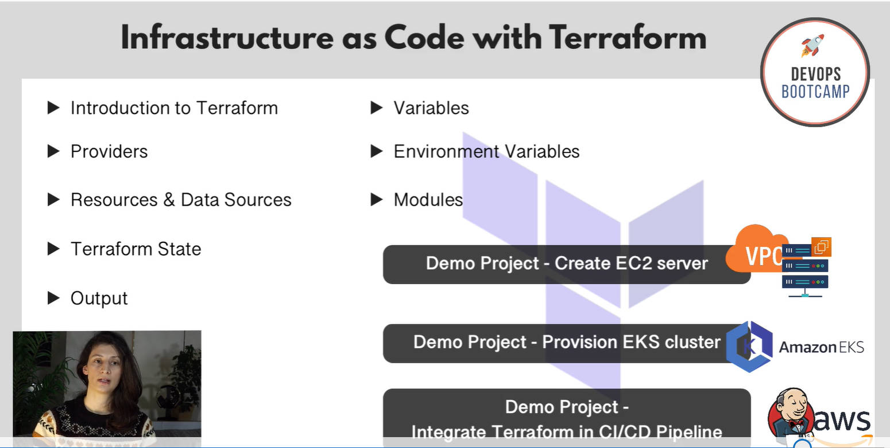

# terraform
Infrastructure as Code with Terraform by Nana

Infrastructure as Code simply means scripting the creation and configuration of your infrastructure.

## This course will cover 

- **Introduction to Terraform**
- **Providers**
- **Resources and data sources**
- **Introduction to Terraform**
- **Terraform State**
- **Output**
- **Environmental Variables**

- **DEMO PROJECT 1: Automate creating an EC2 Server on AWS with firewall and other networking configuration using terraform**
- **Learn how to make terraform configuration reuseable and modular using terraform modules. How to modularize our own projects as well as how to use existing modules from the terraform registry in our projects**

- **DEMO PROJECT 2: USe existing modules to automate provisioning of EKS Cluster on AWS Using Terraform**

- **DEMO PROJECT 3: Integrating Terraform in JJenkins CICD pipeline to automate proviioning infrastructure on AWS before deploying the newly built application**

**What is Terraform?**

Terraform alows you to automate and manage your infrastructure, platform and services that run on that infrastructure. It is open source, and uses declarative language.

Declarative language meaning you don not have to define every step on how this automation and infrastructure management is done. You just define the final and end result and terraform will figure out how to execute it. ***Declarative: this means you define what end result you want*** Imperative language means you define exact steps on how you want the result.
***Terraform is a tool for infrastructure provissioning***

It is suitable to note that infrastruture provissioning should be done in the correct order. Because one task may depend on the other.

### Difference between Ansible and Terraform 
Firat of all,
1. Both Ansible and terraform are Infrastructure as a code (IAC) tool. But however, Terraform is mostly used for Infrastructure provissioining. Meaning they are both used to automate the provissioning, configuring and managing of infrastructure.

However, ***terraform is mainly used as an infratructure provissioning tool**. that's where it's main power lies. it also has the capability to deploy applications in other tools o that infrastructure.

Ansible on the other hand is mainly a ***configuration management tool** so once the infrastructure is provissioned, ansible can now be used to configure the infrastructure, deploy applications on it, install and update softawres on that infrastructure, etc.

Terraform is better for provissioning infrastructure, Ansible is better for configuring that infrastructure. 

- ### Preparing infrastructure (for example on the aws cloud platform) for deploying applciations entails that:
1. Prepare your network space (Private or public network, VPC,)
2. Create users and permissions
3. Create/provission EC2 server instance
4. Install Docker and other tools (if needed) and any other tool you might need for your application.
5. Setup Security like; networks, firewalls, etc.

Once your infrastruture is prepared, the developer can now deploy the docker application on the prepared infrastructure. 

### **Terraform Use Case.**
- **Managing Existing Infrasture**
Terraform makes it easy to provission infrastructure and continously make changes and updates to it.
- **Replicating existing infrastructure.**
After providdioning infrastructure in Dev environment, you might Decide you want to realease your infrastructure to production environment. So terraform can help you replicate a functional architecture from a Dev env onto a prod env. 

***You can easily spin up an identical infrastructure and setup using the same terraform code that you used in the first setup***

### **Terraform Architecture- How Does Terraform Work?**

How does terraform connect to the Infrastructure Provider Platforms (e.g AWS)?
and use all these technologies to provission stuffs?

Terraform has two main components that makes up it's architecture. These are;

**1.  Terraform's Core:**
The core uses two input sources in order to do it's job. It takes terraform configuration 
that you as a user write and where you define what needs to be created or provissioned (TF- Config file is where you specify the infrastures or services you want to provission)

**2. Terraform State:** where terraform keeps the "up to date" state of the current setup of how the infrastruture looks like.

So the terraform core takes this inpute (TF- Config & Terraform State) and figgure out the plan (what needs to be created, updated or destroyed) of what needs to be done. So the core compare what is the current state of the infrastructure to what is in the desired state/ end result (TF-config file). Terrafrom now figures out what needs to be done to get to the desired state as defined in the configuration file. 

3. **Providers for specific technologies:** for infrastructure level task,
This could be AWS, Azure or other IaaS platforms.

Terraform also has providers for other high level components like Kubernetes (K8s) and other PaaS. Also some SaaS tools like Fastly.

Terraform has over 100 Providers and each provider gives terraform user access to it's resources